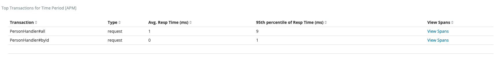

# webflux-demo

elasticsearch에서 제공하는 apm-agent 적용 예제

## Building app
빌드할 때 테스트는 스킵한다.

    $./mvnw clean install -DskipTests
    
## Running app with apm-agent
app를 apm-agent와 같이 실행한다.
* [jar file download site](https://search.maven.org/search?q=g:co.elastic.apm%20AND%20a:elastic-apm-agent)

* [source git](https://github.com/elastic/apm-agent-java)

실행 명령어

    $java -javaagent:/path/elastic-apm-agent-1.1.0.jar -Delastic.apm.service_name=webflux-demo \
    -Delastic.apm.application_packages=com.azoci.demo.webfluxdemo \
    -Delastic.apm.server_urls=http://example:8201 -jar webflux-demo-0.0.1-SNAPSHOT.jar
    
Kibana 대시보드

